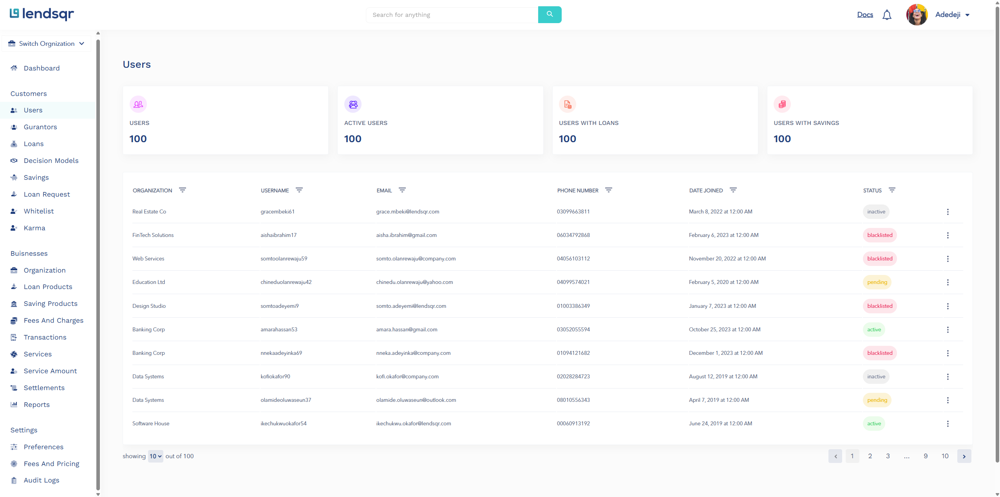

# Lendsqr Frontend Dashboard (Assessment Submission)

# Overview

This project is a frontend implementation of an internal admin/dashboard interface, modeled after the Lendsqr Admin Console. It was built as a technical assessment to demonstrate frontend engineering fundamentals: structure, component design, data presentation, and decision-making.

## Author

- [@Peacebern](https://github.com/peacebern)

## Optimizations

Utilized cust hooks to Improve Perfomance e.g using the useMemo hook to handle the table pagination improved the performance by 100%.

## Demo

# Tech Stack

* React – Component-driven UI development

* TypeScript – Type safety and clearer contracts

* Vite – Fast development and modern tooling

* SCSS / CSS Modules – Scoped, maintainable styling

* React Router – Client-side navigation

* Mock data – Used to simulate backend responses

# Reason for this stack
This mirrors a common production setup for internal dashboards: React for flexibility, TypeScript for safety, and scoped styles to avoid UI regressions as the app grows. 

## PROJECT STRUCTURE

src/
├── assets/        # Images and static assets
├── components/    # Reusable UI components
├── pages/         # Route-level views
├── routes/        # Route configuration
├── styles/        # Global and modular styles
├── types/         # Shared TypeScript types
├── utils/         # Helpers and mock data
├── App.tsx        # Root component & layout
└── main.tsx       # Application entry point

## Application Flow

* The app boots from main.tsx

* App.tsx defines global layout and routing

* Each page represents a major admin view (Dashboard, Users, User Details)

* Reusable components handle tables, cards, and layout primitives

* Data is currently mocked to reflect realistic API responses

## Running this Project
npm install
npm run dev

## Project Best Practices

- Keep a well-organized folder structure
- Maintain a consistent import order
- Follow clear naming conventions
- Enforce code quality with a linter
- Leverage snippet libraries for efficiency
- Style components using SCSS
- Avoid creating unnecessary components

## Features

- Live previews
- Fullscreen mode
- Cross platform
- user management

## How to Navigate the Codebase

* Start here: src/main.tsx

* Then: src/App.tsx for layout and routing

* Pages: src/pages/
* Reusable components: src/components/
